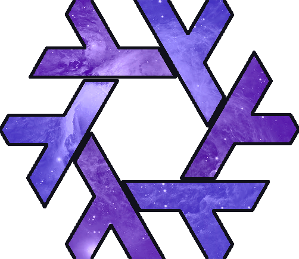

<h1 align="center"></h1>
<h2 align="center">NEBULA: My NixOS flake based off of <a href="https://github.com/ardishko/SMPL">SMPL</a></h2>

<h1 align="center">
  
  
  
  
  
</h1>

  
🖼️ Gallery

(WIP)

  
🕸️ Topology Diagram

(WIP)

---

<h3>
  Special Thanks
</h3>

[Ardishco](https://github.com/ardishko) for making the SMPL template that this config is based off of

[NotAShelf](https://github.com/notashelf) for making NVF
